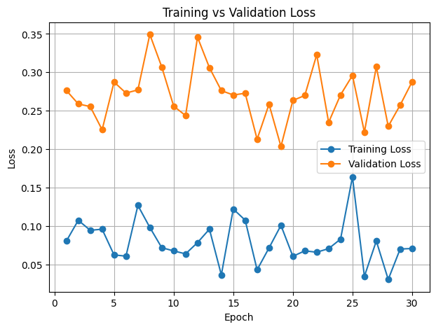
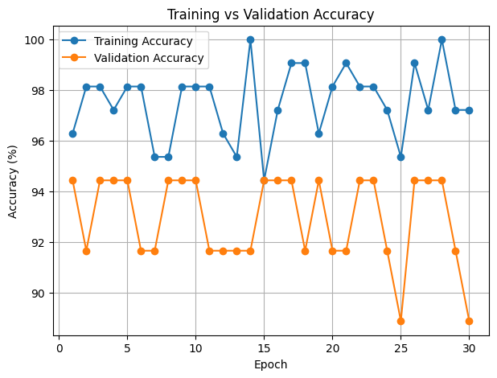
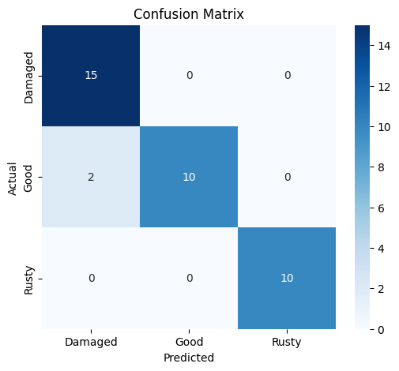

# Automatic Inspection Rover

An intelligent vision-based gear inspection system that leverages **Transfer Learning** with **MobileNetV2** to automatically classify gears into **Good**, **Rusty**, and **Damaged** categories. The project is designed as a foundation for automated industrial quality inspection and inspection rover applications.

---

## Overview

Manual gear inspection is time-consuming, subjective, and prone to human error. This project automates the inspection process using a deep learning model trained on gear images, enabling fast and consistent classification.

The model is trained using **PyTorch** with a pretrained **MobileNetV2** backbone and evaluated on a completely unseen test dataset.

---

## Features

- Transfer Learning using MobileNetV2
- Automatic Train/Validation Split
- Data Augmentation
- Best Model Checkpoint Saving
- Training & Validation Visualization
- Evaluation on Unseen Test Dataset
- Classification Report
- Confusion Matrix
- Sample Prediction Visualization

---

## Dataset

The dataset consists of three gear conditions:

| Class | Description |
|--------|-------------|
| Good | Healthy gear |
| Rusty | Gear with visible corrosion |
| Damaged | Gear with structural damage |

All images are resized to **224 × 224** before training.

---

## Data Preprocessing

### Training Transformations

- Resize (224 × 224)
- Random Horizontal Flip
- Random Rotation
- Color Jitter
- Normalization

### Validation & Test Transformations

- Resize (224 × 224)
- Normalization

No random augmentation is applied during validation or testing.

---

## Model Architecture

- Backbone: **MobileNetV2 (ImageNet Pretrained)**
- Framework: **PyTorch**
- Transfer Learning
- Frozen Feature Extractor
- Custom 3-Class Classification Head

---

## Training Configuration

| Parameter | Value |
|-----------|--------|
| Optimizer | Adam |
| Learning Rate | 0.001 |
| Loss Function | CrossEntropyLoss |
| Batch Size | 8 |
| Input Size | 224 × 224 |
| Epochs | 30 |

---

# Results

## Test Performance

| Metric | Value |
|---------|------:|
| Test Accuracy | **94.59%** |
| Classes | 3 |
| Model | MobileNetV2 |

---

## Training Curves

### Training vs Validation Loss

<p align="center">

</p>

### Training vs Validation Accuracy

<p align="center">

</p>

---

## Confusion Matrix

<p align="center">

</p>

---

## Project Structure

```text
Automatic-Inspection-Rover/
│
├── Dataset/
│   ├── Train/
│   └── Test/
│
├── Models/
│   └── best_model.pth
│
├── Notebooks/
│   ├── training.ipynb
│   └── testing.ipynb
│
├── images/
│   ├── accuracy_curve.png
│   ├── loss_curve.png
│   └── confusion_matrix.png
│
├── requirements.txt
├── README.md
└── .gitignore
```

---

## Installation

Clone the repository

```bash
git clone https://github.com/your-username/Automatic-Inspection-Rover.git
```

Move into the project directory

```bash
cd Automatic-Inspection-Rover
```

Install the required dependencies

```bash
pip install -r requirements.txt
```

---

## Usage

### Model Training

Run

```text
Notebooks/training.ipynb
```

This notebook:

- Loads the dataset
- Applies preprocessing and augmentation
- Trains the MobileNetV2 model
- Saves the best-performing model
- Generates training visualizations

---

### Model Evaluation

Run

```text
Notebooks/testing.ipynb
```

This notebook:

- Loads the saved model
- Evaluates on the unseen test dataset
- Computes test accuracy
- Generates the confusion matrix
- Produces the classification report

---

## Technologies Used

- Python
- PyTorch
- Torchvision
- OpenCV
- NumPy
- Matplotlib
- Scikit-learn
- Seaborn

---

## Author

**Giriraj Lakhani**

B.Tech, Mechanical Engineering  
Indian Institute of Technology (BHU), Varanasi

**Priyanshu Tulsyan**

B.Tech, Mechanical Engineering  
Indian Institute of Technology (BHU), Varanasi

---

## License

This project is released under the MIT License.
